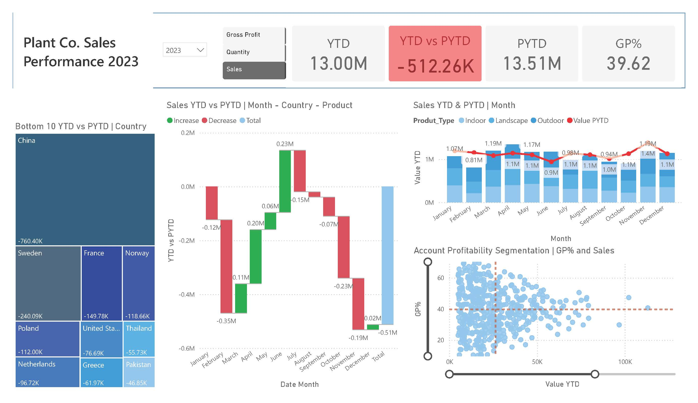

# Plant Co. Performance Analysis - Power BI Dashboard


## 📌 Project Overview
The **Plant Co. Performance Analysis** project is a comprehensive business intelligence dashboard designed to monitor, evaluate, and visualize the key performance indicators (KPIs) of Plant Co. This report transforms raw operational and sales data into actionable insights, enabling stakeholders to make data-driven decisions regarding inventory management, sales trends, and overall profitability.



## 🔍 Top Analysis & Insights

This report provides deep dives into several critical areas of the business. Here are the top analytical highlights showcased in this portfolio project:

### 1. Sales & Revenue Trends
* **Year-over-Year (YoY) Growth:** Analyzed revenue growth across different quarters, highlighting seasonal peaks in plant sales.
* **Top Performing Categories:** Identified the top-selling plant categories (e.g., Indoor, Outdoor, Succulents) and their contribution to the total profit margin.
* **Geographical Performance:** Mapped out sales distribution across various regions to pinpoint high-growth markets and underperforming territories.

### 2. Operational Efficiency & Inventory
* **Stock Turnover:** Evaluated inventory levels against sales velocity to highlight risks of overstocking or stockouts.
* **Fulfillment Metrics:** Analyzed order-to-delivery times to assess supply chain efficiency.

### 3. Profitability Analysis
* **Cost vs. Revenue:** A detailed breakdown of operational costs versus gross revenue to determine the true net profit.
* **Customer Segment Profitability:** Segmented buyers (e.g., Wholesale vs. Retail) to identify which customer base yields the highest Customer Lifetime Value (CLV).

## 🚀 Key Features

* **Dynamic Filtering:** Slicers for Date (Year/Quarter/Month), Region, and Product Category allow users to interactively drill down into the data.
* **Advanced DAX Measures:** Utilized Data Analysis Expressions (DAX) to calculate rolling averages, YoY growth, and cumulative totals.
* **Custom Tooltips:** Enhanced user experience by embedding secondary visualizations within tooltips to provide extra context without cluttering the main canvas.
* **What-If Parameters:** Interactive scenario planning to see how changes in pricing or costs impact the overall bottom line.

## 🗄️ Data Model & Architecture

The report relies on a robust relational data model optimized for Power BI's VertiPaq engine. 


* **Fact Tables:** Contains transactional data (Sales, Orders).
* **Dimension Tables:** Includes descriptive attributes (Calendar/Date, Products, Customers, Geography).
* **Relationship Type:** Built using a standard Star Schema framework (1-to-many relationships) to ensure optimal calculation performance and accurate filtering.

## 🛠️ Technical Specifications
* **Tool Used:** Power BI Desktop
* **Data Transformation:** Power Query (M Language) used for data cleaning, unpivoting, and handling missing values.
* **Techniques:** Star Schema Modeling, Time Intelligence DAX, Data Storytelling.

## 📂 How to Use This Repository

1. Clone the repository to your local machine:
   ```bash
   git clone [https://github.com/yourusername/plant-co-performance-analysis.git](https://github.com/yourusername/plant-co-performance-analysis.git)
